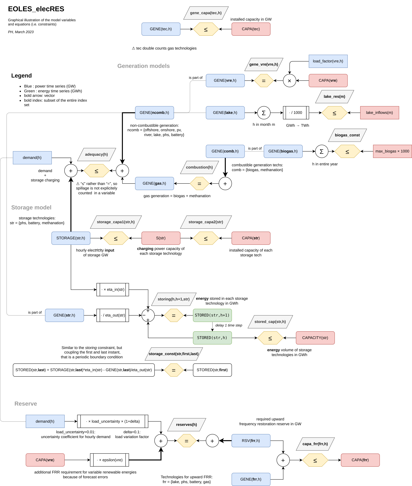

# EOLES_elecRES in Julia

This repository is a translation to [Julia](https://julialang.org/) (with the [JuMP](https://jump.dev/) package) 
of the 100% renewable electricity optimization model [EOLES_elecRES](https://github.com/BehrangShirizadeh/EOLES_elecRES) which is written in [GAMS](https://www.gams.com/latest/docs/UG_MAIN.html)
by B. Shirizadeh, Q. Perrier and P. Quirion.

The goal is to allow running the open source EOLES_elecRES model in an **open source environment** (while GAMS is commercial).
The translation is kept as close as possible to the original GAMS code and is meant to be fully compatible,
e.g. by running on the same input files.

## Repository content

- [EOLES_elecRES_Julia.ipynb](EOLES_elecRES_Julia.ipynb): Jupyter notebook. Port of the [EOLES_elecRES.gms](https://github.com/BehrangShirizadeh/EOLES_elecRES/blob/master/model/EOLES_elecRES.gms) GAMS model.
  - status: OK (produces similar results, but needs some more checks)
- [inputs](inputs): copy of the input folder of `EOLES_elecRES`
- draft graphical representation of the equations (made with [draw.io/diagrams.net](https://www.diagrams.net/))

## License

See [LICENSE.txt](LICENSE.txt).
This derivative work is made available under the same
[CC BY-NC-SA 4.0](http://creativecommons.org/licenses/by-nc-sa/4.0/) license as the original `EOLES_elecRES` model.